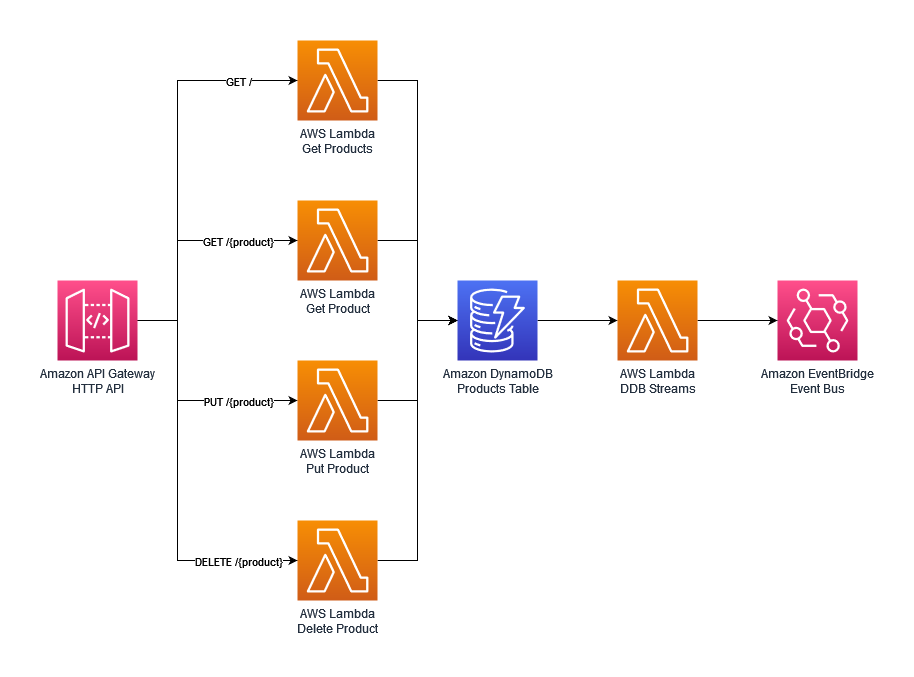

## Serverless Rust Demo


<p align="center">
  
</p>

This is a simple serverless application built in Rust. It consists of an API Gateway backed by four Lambda functions and a DynamoDB table for storage.

This single crate will create [five different binaries](./src/bin), one for each Lambda function. It uses an [hexagonal architecture pattern](https://aws.amazon.com/blogs/compute/developing-evolutionary-architecture-with-aws-lambda/) to decouple the [entry points](./src/entrypoints/), from the main [domain logic](./src/lib.rs), the [storage component](./src/store), and the [event bus component](./src/event_bus).

## 🏗️ Deployment and testing

### Requirements

* [Rust](https://www.rust-lang.org/) 1.56.0 or higher
* [cargo-lambda](https://github.com/calavera/cargo-lambda)
* [Zig](https://ziglang.org/) for cross-compilation (cargo-lambda will prompt you to install it if it's missing in your host system)
* The [AWS SAM CLI](https://docs.aws.amazon.com/serverless-application-model/latest/developerguide/serverless-sam-cli-install.html) 1.33.0 or higher for deploying to the cloud
* [Artillery](https://artillery.io/) for load-testing the application

### Commands

You can use the following commands at the root of this repository to test, build, and deploy this project:

```bash
# Optional: check if tools are installed
make setup

# Run unit tests
make tests-unit

# Compile and prepare Lambda functions
make build

# Deploy the functions on AWS
make deploy

# Run integration tests against the API in the cloud
make tests-integ
```

## Load Test

[Artillery](https://www.artillery.io/) is used to make 300 requests / second for 10 minutes to our API endpoints. You can run this
with the following command:

```bash
make tests-load
```

### CloudWatch Logs Insights

Using this CloudWatch Logs Insights query you can analyse the latency of the requests made to the Lambda functions.

The query separates cold starts from other requests and then gives you p50, p90 and p99 percentiles.

```
filter @type="REPORT"
| fields greatest(@initDuration, 0) + @duration as duration, ispresent(@initDuration) as coldStart
| stats count(*) as count, pct(duration, 50) as p50, pct(duration, 90) as p90, pct(duration, 99) as p99, max(duration) as max by coldStart
```


## 🦀 Getting started with Rust on Lambda

If you want to get started with Rust on Lambda, you can use [these cookiecutter templates](https://github.com/aws-samples/cookiecutter-aws-sam-rust) to setup your project.

## 👀 With other languages

You can find implementations of this project in other languages here:

* [🐿️ Go](https://github.com/aws-samples/serverless-go-demo)
* [⭐ Groovy](https://github.com/aws-samples/serverless-groovy-demo)
* [☕ Java with GraalVM](https://github.com/aws-samples/serverless-graalvm-demo)
* [🤖 Kotlin](https://github.com/aws-samples/serverless-kotlin-demo)
* [🏗️ TypeScript](https://github.com/aws-samples/serverless-typescript-demo)
* [🥅 .NET](https://github.com/aws-samples/serverless-dotnet-demo)

## Security

See [CONTRIBUTING](CONTRIBUTING.md#security-issue-notifications) for more information.

## License

This library is licensed under the MIT-0 License. See the LICENSE file.

